# Circlepot Smart Contracts

A comprehensive DeFi savings platform built on blockchain, enabling both community-based and individual savings solutions with reputation-based trust mechanisms and yield-bearing options.

## Overview

Circlepot digitizes traditional rotating savings and credit associations (ROSCAs) using blockchain technology. Unlike traditional ROSCAs, Circlepot puts idle funds to work through yield-bearing vaults.

## Core Features

- **Yield-Bearing Savings**: Choose between "Standard" (no DeFi risk) and "Yield" (interest-earning) modes for both circles and personal goals.
- **Gasless Transactions**: EIP-7702 account abstraction powered by Thirdweb sponsors all user gas fees.
- **Reputation Scoring**: On-chain credit scoring adapted from standard FICO/VantageScore models.
- **90/10 Yield Sharing**: 90% of earned yield goes to the community/user, while 10% supports the platform.
- **Extensible Architecture**: Built with future-proof support for dynamic ERC20 tokens.

## Smart Contracts

### 🔄 CircleSavings

A community-based savings platform for groups. Members contribute funds (primarily Mento USDC) regularly and rotate receiving the collective pot.

**Key Features:**

- **Dual-Mode Choice**: Creators choose between Standard and Yield-bearing circles.
- **Automatic Yield Deployment**: Collateral is instantly moved to ERC-4626 vaults in Yield mode.
- **Reputation-Based Ordering**: Payout order is assigned based on user reputation at start-time.
- **DEAD State & Liquidation**: Automated bulk liquidation if a circle fails to meet capacity or the start-vote fails.
- **Democratic Voting**: Members can vote to "Start early" or "Withdraw" during the pending phase.

---

### 💰 PersonalSavings

An individual savings solution for personal financial goals with yield options and extensible asset support.

**Key Features:**

- **Goal-Mode Selection**: Choose Standard for safety or Yield to earn interest on your progress.
- **Primary Support for USDC**: Optimized for Circle USDC with architectural support for future assets.
- **Graduated Penalties**: Access funds early with progress-based fees (0% penalty at 100% completion).
- **Reputation Rewards**: Completing goals boosts your on-chain credit score.

---

### ⭐ Reputation

An on-chain credit scoring system that tracks financial behavior to build trust and reward responsibility.

**Key Features:**

- **Tiered Scoring**: Behavior-based reputation tiers (Bronze to Platinum).
- **Positive/Negative Impact**: Points for on-time contributions and goal completion; penalties for late payments.
- **Priority Access**: Higher reputation grants better payout positions and access to larger circles.

---

### 👤 UserProfile

Manages user identity and cross-platform profile data using unique usernames.

---

## Visual Workflow

```mermaid
flowchart TD
    subgraph A [1. ONBOARDING & FUNDING]
        direction TB
        A1[Start] --> A2[Sign Up<br>60s - Email/Google/Phone]
        A2 --> A3[Thirdweb Creates<br>Smart Contract Wallet]
        A3 --> A4[Add Funds USDC]

        subgraph A4_Sub [Funding Methods]
            A4_1[🏦 Base Partner On-Ramp]
            A4_2[🔄 Crypto Exchange]
        end

        A4 --> A4_Sub
        A4_Sub --> A5{Funds Added?}
        A5 -- Yes --> A6[Wallet Funded & Ready]
        A5 -- No --> A4
    end

    A6 --> B{User Choice}

    subgraph C [2. SAVINGS CIRCLES JOURNEY]
        B -- Create/Join Circle --> C1{Create or Join Circle?}

        C1 -- Create --> C2[Create Circle<br>Manual Setup]
        C2 --> C2_1{Choose Mode}
        C2_1 -- Standard --> C3
        C2_1 -- Yield --> C2_2[Collateral earns DeFi Interest] --> C3

        C3[Lock Collateral<br>Gasless via Thirdweb]
        C3 --> C4[Get Position #1<br>Share Invite Link]
        C4 --> C5_0{60% Capacity Met?}

        C1 -- Join --> C6[Browse or Use Invite Link]
        C6 --> C7[Review & Lock Collateral]
        C7 --> C5_0

        C5_0 -- No & Ultimatum Reached --> C5_DEAD[DEAD State<br>Bulk Liquidation of Principal]
        C5_0 -- Yes --> C5_VOTE{Voting Phase<br>Start vs Withdraw}

        C5_VOTE -- Withdraw Wins --> C5_DEAD
        C5_VOTE -- Start Wins --> C8[Assign Positions<br>Based on Reputation]
        C8 --> C5[Circle Starts]
    end

    subgraph D [3. CONTRIBUTION CYCLE]
        C5 --> D1[Manual Contribution<br>User Initiated]
        D1 --> D2[Zero Gas Fees<br>EIP-7702 Sponsorship]
        D2 --> D3{On-Time?}
        D3 -- Yes --> D4[Earn Performance Points]
        D3 -- Late --> D5[Late Fee Charged<br>Reputation Hit]
        D5 --> D4
        D4 --> D6{Round Completed?}
        D6 -- No --> D1
    end

    subgraph E [4. CIRCLE PAYOUT]
        D6 -- Yes --> E1[Your Turn for Payout?]
        E1 -- Yes --> E2[Automated Payout<br>1% Fee or $10 Flat]
        E2 --> E2_1{Yield Mode?}
        E2_1 -- Yes --> E2_2[90/10 Yield Split<br>Community + Owner Share]
        E2_1 -- No --> E3
        E2_2 --> E3[💰 Instant USDC to Wallet]
        E3 --> E4[Reputation Boost]
        E4 --> E5[Circle Progresses/Completes]
        E1 -- No --> D1
    end

    subgraph F [PERSONAL SAVINGS GOAL JOURNEY]
        B -- Create Personal Goal --> F1[Create Goal<br>Manual Setup]
        F1 --> F1_1{Choose Mode}
        F1_1 -- Standard --> F2
        F1_1 -- Yield --> F1_2[Earn DeFi Interest] --> F2
        F2[No Collateral Required]
        F2 --> F3[Manual Contributions<br>User Initiated]
        F3 --> F4{Goal Completed?}
        F4 -- No --> F5{Early Withdrawal?}
        F5 -- No --> F3
        F5 -- Yes --> F6[Apply Progress-Based Penalty<br>0.1% - 1.0%]
        F6 --> F7[Goal Principle + 90% Yield]
        F7 --> F9_Finished
        F4 -- Yes --> F8[Goal Payout + 90% Yield<br>+ Reputation Points]
        F8 --> F9_Finished[Goal Achieved!]
    end

    subgraph G [KEY FEATURES & INFRASTRUCTURE]
        G1[🟡 Thirdweb Account Abstraction]
        G2[💚 Base L2 & Mento USDC]
        G3[📈 ERC-4626 Yield Vaults]
        G4[🗳️ Democratic Voting System]
        G5[⛽ Sponsored Gas EIP-7702]
        G6[🔒 Collateral Security]
        G7[⭐ Reputation Scoring]
        G8[🏦 Base Ecosystem On/Off-Ramps]
    end

    classDef primaryJourney fill:#e1f5fe,stroke:#01579b,stroke-width:2px
    classDef goalJourney fill:#f3e5f5,stroke:#4a148c,stroke-width:2px
    classDef infrastructure fill:#fff8e1,stroke:#ff6f00,stroke-width:1px

    class C,D,E primaryJourney
    class F goalJourney
    class G infrastructure
```

## Security

- **Self-Custodial**: Users maintain full control of their keys via Thirdweb's secure architecture.
- **Collateral-Backed**: All circles require one-round of collateral to protect the group.
- **Audited Logic**: Designed with safety-first principles and comprehensive test suites.

## Contributing

Contributions are welcome! Please feel free to submit a Pull Request.

1. Fork the repository
2. Create your feature branch (`git checkout -b feature/AmazingFeature`)
3. Commit your changes (`git commit -m 'Add some AmazingFeature'`)
4. Push to the branch (`git push origin feature/AmazingFeature`)
5. Open a Pull Request

## License

No License

---

**Built with ❤️ by the Circlepot Team**
