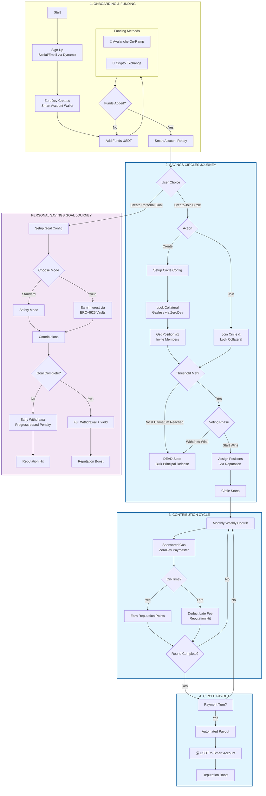

# Circlepot Smart Contracts

A comprehensive social savings platform built on **Avalanche**, enabling both community-based (ROSCAs) and individual savings solutions with reputation-based trust mechanisms and decentralized yield options.

## Overview

Circlepot digitizes traditional rotating savings and credit associations (ROSCAs) and personal savings goals using blockchain technology. By combining community-driven saving mechanisms with on-chain reputation scoring and gasless transactions, Circlepot provides a transparent, trustless, and user-friendly experience for savers worldwide.

## Core Features

- **Gasless User Experience**: Powered by **ZeroDev Kernel v3** and Sponsored Paymasters, users interact with the blockchain without needing to manage gas fees or native AVAX.
- **Yield-Bearing Goals**: Choose between "Standard" (no DeFi risk) and "Yield" (interest-earning via ERC-4626) modes for personal savings goals.
- **Reputation Registry**: An on-chain credit scoring system that tracks user reliability (on-time payments, goal completions) to incentivize positive behavior.
- **Democratic Governance**: Members in community circles can vote on circle lifecycle events (e.g., deciding to start or withdraw from a pending circle).
- **Scalable Stablecoin Support**: Built to support multiple ERC20 tokens, with a primary focus on **USDT (Avalanche)** for price stability.

## Smart Contracts

### 🔄 CircleSavings.sol

Manages community-based savings circles (ROSCAs). Members contribute funds regularly and rotate receiving the collective pot.

**Key Features:**

- **Principal Protection**: Focuses on social coordination and principal security; funds are held safely in the contract during the rotation.
- **Collateral-Backed**: Members lock 100% of one round's contribution plus a late fee buffer to join, ensuring the schedule is honored.
- **Reputation-Based Ordering**: Payout order is assigned based on user reputation scores at the moment the circle starts.
- **Voting System**: Decisions to start early or withdraw from pending circles are democratically decided by participants.
- **Automated Payouts**: The contract manages the automated distribution of the pot to the scheduled recipient each round.

---

### 💰 PersonalSavings.sol

An individual savings solution for personal financial goals with optional yield generation.

**Key Features:**

- **Goal-Mode Selection**: Choose Standard for safety or Yield to earn interest on your savings through **ERC-4626 Tokenized Vaults**.
- **Yield Sharing**: The platform captures a 10% share of generated yield, while 90% goes directly to the user.
- **Graduated Penalties**: Flexible access to funds with progress-based early withdrawal fees (0% penalty at 100% completion).
- **Referral Integration**: Incentivizes growth and onboarding of new savers.

---

### ⭐ Reputation.sol

A unified registry for tracking and rewarding financial reliability across the entire Circlepot ecosystem.

**Key Features:**

- **Dynamic Scoring**: Behavior-based points for on-time contributions, payout reception, and goal completions.
- **Negative Impact**: Penalties for late payments or early goal withdrawals to protect the community.
- **Score Categorization**: Translates raw points into recognizable trust tiers.

---

## Visual Workflow

## Security & Architecture

- **Self-Custodial**: Users maintain full control of their accounts via Dynamic + ZeroDev secure architecture.
- **Collateral-Backed**: Community circles require 100% of one round + late fee buffer to ensure participant commitment.
- **Isolated Yield Risk**: DeFi yield exposure is strictly isolated to Personal Goals, protecting the core community saving experience.
- **UUPS Upgradeable**: All core contracts use the Universal Upgradeable Proxy Standard for secure logic updates.

## Technical Stack

- **Network**: Avalanche Fuji / C-Chain
- **AA Provider**: ZeroDev (Kernel v3)
- **Auth**: Dynamic
- **Contracts**: Solidity 0.8.27
- **Indexing**: The Graph (Subgraph)
- **Stablecoin**: USDT

---

**Built with ❤️ by the Circlepot Team**
